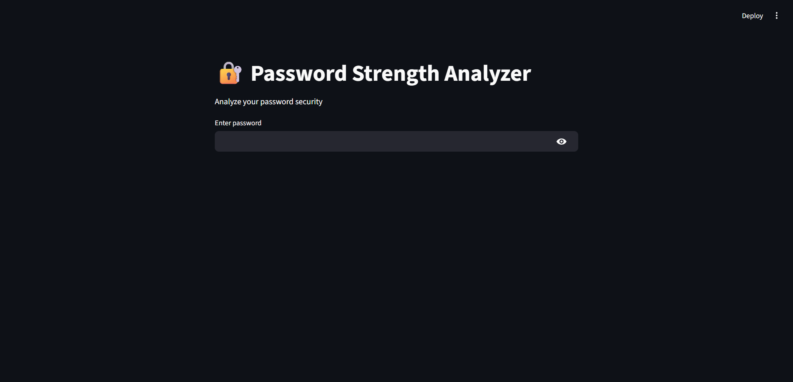
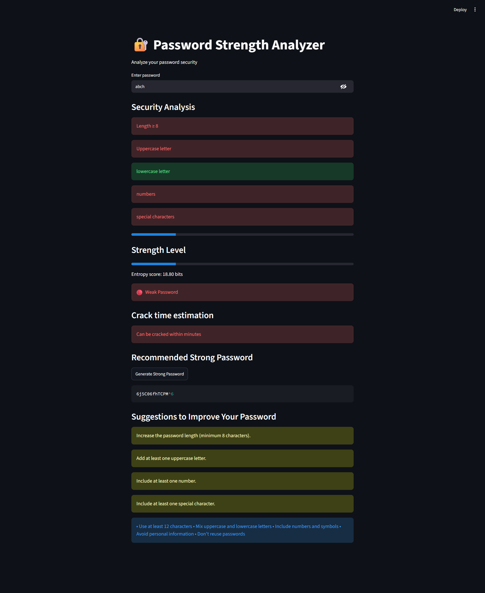
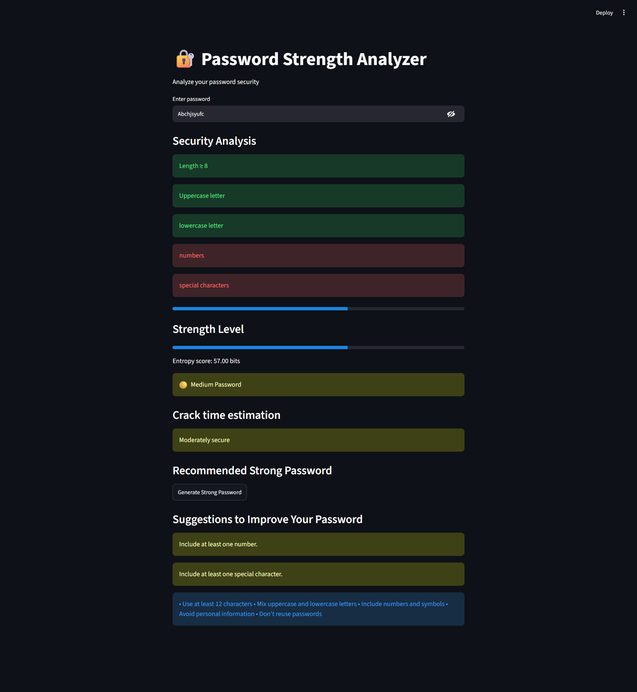
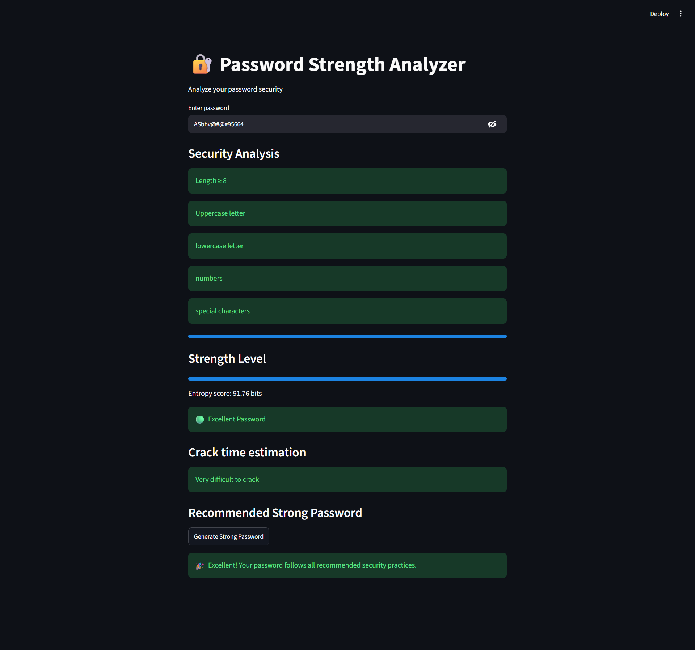

# 🔐 Password Strength Analyzer

A simple and interactive **Password Strength Analyzer** built with **Python** and **Streamlit**. This application helps users evaluate the strength of their passwords by checking common security requirements, estimating password entropy, predicting crack time, and providing personalized suggestions to improve password security.

---

## ✨ Features

* 🔍 Analyze password strength instantly
* 📏 Check password length
* 🔠 Detect uppercase and lowercase letters
* 🔢 Detect numbers
* 🔣 Detect special characters
* 📊 Display password strength with a progress bar
* 🧮 Calculate password entropy
* ⏳ Estimate password crack time
* 🔐 Generate a strong random password
* 💡 Show personalized suggestions for weak passwords

---

## 🛠️ Built With

* Python 3
* Streamlit
* Regular Expressions (`re`)
* Math
* Random
* String

---

## 📁 Project Structure

```text
PasswordStrength/
│
├── screenshots/
│   ├── screenshot1.png
│   ├── screenshot2.png
│   ├── screenshot3.png
│   └── screenshot4.png
│
├── PasswordStrengthAnalyzer.py
├── README.md
├── requirements.txt
└── .gitignore
```

---

## ⚙️ Installation

### 1. Clone the repository

```bash
git clone https://github.com/asipali/password_strength_analyzer.git
```

### 2. Navigate to the project directory

```bash
cd password_strength_analyzer
```

### 3. Install the required packages

```bash
pip install -r requirements.txt
```

### 4. Run the application

```bash
streamlit run PasswordStrengthAnalyzer.py
```

---

## 🔍 How It Works

The application evaluates a password using the following security checks:

* Minimum length of 8 characters
* At least one uppercase letter
* At least one lowercase letter
* At least one number
* At least one special character

Based on these checks, it:

* Calculates the password entropy
* Classifies the password as Weak, Medium, Strong, or Excellent
* Estimates how difficult the password is to crack
* Suggests improvements for weak passwords
* Generates a secure random password on demand

---

## 📸 Screenshots

### Home Screen



### Weak Password Analysis



### Medium Password Analysis



### Strong Password Analysis



---

## 🚀 Future Improvements

* Show/Hide password option
* Password breach detection using the Have I Been Pwned API
* Common password blacklist
* Password copy-to-clipboard button
* Password history check
* Password strength visualization charts
* Advanced password scoring using zxcvbn

---

## 👨‍💻 Author

**Asip Ali**

GitHub: https://github.com/asipali
